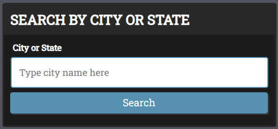
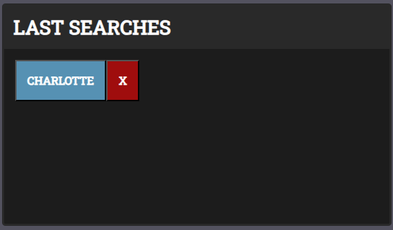
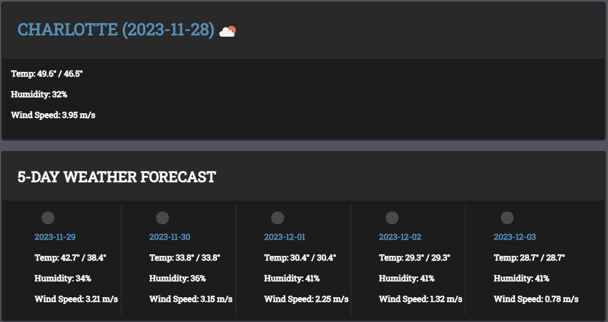

# 06-Weather-Forecast

## Description

Before embarking on your daily activities, it's crucial to be well-prepared for the weather. Our webpage offers users the convenience of accessing real-time weather information for their location, enabling them to plan their day effectively. The website not only provides current weather conditions but also forecasts for the next five days, empowering users with valuable insights into upcoming weather patterns. Through this website, I was able to better understand how to fetch and retrieve data information from third party API. Moreover, the website incorporates the use of local storage, a powerful tool that enhances user convenience. By saving the user's input, it enables them to easily retrieve information without the need for repetitive data entry.

## Table of Contents (Optional)

If your README is long, add a table of contents to make it easy for users to find what they need.

- [Installation](#installation)
- [Usage](#usage)
- [Credits](#credits)
- [License](#license)

## Installation

N/A

## Usage

Website: 


When the user first enters the website, they will see that only the search form and an empty history is displayed. In order to get the weather, the user will need to input a city/ state name into the search bar. If there is nothing in the search bar, an alert message will display requesting the user to enter in a city/ state name. Once they enter a city/ state, the weather will display as well as a button of the city saved in the history bar. The history will allow the user to easily access their previous searches and retrieve information back just by clicking the button. They can also delete it by clicking the red "X" button. On the right, all the weather information for that city/ state will display for today and the next 5 days. 
--

    ```md
    
    ```

    ```md
    
    ```

    ```md
    
    ```

## Credits

N/A

## License

N/A

## Badges

N/A

## Features

N/A

## How to Contribute

N/A

## Tests

N/A