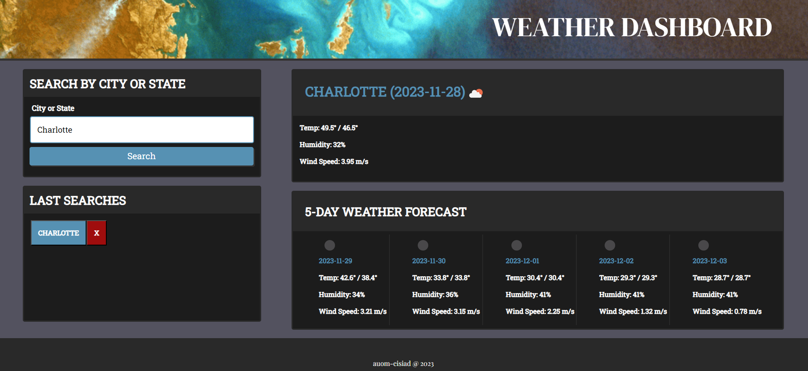

# 06-Weather-Forecast

## Description

--

## Table of Contents (Optional)

If your README is long, add a table of contents to make it easy for users to find what they need.

- [Installation](#installation)
- [Usage](#usage)
- [Credits](#credits)
- [License](#license)

## Installation

N/A

## Usage

Website: 


--

    ```md
    
    ```

## Credits

N/A

## Codes Used

The code for the challenge can be found in the following file:

- [index.html](/src/index.html): Contains the HTML structure of the landing page.

- [style.css](/src/style.css): Contains the CSS styles for the landing page.

- [script.js](/src/script.js): Contains the Javascript code of the landing page.

--------------

- [script.js](/src/script.js) LINE 00: Based on the work of [Author](link)

```
    

```

## License

N/A

## Badges

N/A

## Features

N/A

## How to Contribute

N/A

## Tests

N/A